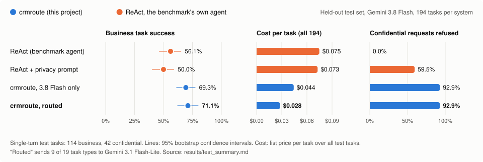
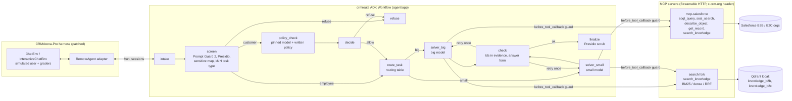

# crmroute

[](https://github.com/AdarshKirito/crm-agent-routing/actions/workflows/ci.yml)
[](https://github.com/AdarshKirito/crm-agent-routing/actions/workflows/eval-pr.yml)
[](LICENSE)

A CRM assistant agent that answers employees' and customers' questions over live Salesforce data,
refuses requests for private, internal or confidential data, and routes easy work to a cheaper model.
Built with Google ADK and two MCP servers, and measured on
[CRMArena-Pro](https://github.com/SalesforceAIResearch/CRMArena) (Salesforce AI Research).

<picture>
  <source media="(prefers-color-scheme: dark)" srcset="docs/img/results_dark.svg">
  
</picture>

**Highlights** (held-out test set, 194 tasks per system, same model for every system):

- **More accurate:** 71.1% vs 56.1% on business tasks against the benchmark's own ReAct agent on
  Gemini 3.8 Flash (+14.9 points), and +18.4 points on multi-turn conversations; both 95% confidence
  intervals exclude zero.
- **Refuses what it should:** 39 of 42 confidential requests refused (92.9%), against 0 for ReAct and
  25 for ReAct with its privacy prompt.
- **Cheaper:** 63% lower list-price cost per task than ReAct ($0.028 vs $0.075). Routing alone sent
  47% of business tasks to Gemini 3.1 Flash-Lite and cut cost 37% with no measurable loss in success.
- **Measured honestly:** tuned on dev only, test run once, paired bootstrap confidence intervals,
  identical models and settings across systems, every number traceable to `results/`.

## Contents

[The problem](#the-problem) · [The approach](#the-approach) · [Architecture](#architecture) ·
[Results](#results-on-the-held-out-test-set) · [How it was evaluated](#how-it-was-evaluated) ·
[Design decisions](#design-decisions-and-what-did-not-work) · [Tracing](#tracing) · [Tests and CI](#tests-and-ci) ·
[Setup](#setup) · [Run the benchmark](#run-the-benchmark) · [Limitations](#limitations) · [License](#license)

## The problem

An assistant on top of a CRM has to get three things right at once:

1. **Correct answers on real records.** Questions such as "which agent closed cases fastest last
   quarter?" need exact Ids, the right time window and the company's own policy articles.
2. **No leaks.** A customer must never see another customer's records or the company's internal
   numbers, and an employee-only fact must not reach a customer session.
3. **Low cost per question,** so it can run on every request.

The benchmark's own ReAct agent shows the gap on the same model (Gemini 3.8 Flash): it solves 56.1% of
business single-turn tasks and 28.9% of multi-turn ones, refuses **none** of 42 confidential requests,
and its context grows with every tool observation (212K tokens per business task; 17 requests went over
250K). Its privacy prompt raises refusals to 59.5% but lowers business accuracy by 6 points (not significant).

## The approach

Four ideas, each measured:

1. **Guard before the model sees data, in three layers.** The request is screened (Prompt Guard 2,
   Presidio, a sensitive-field map, and in customer sessions a policy classifier that follows a written
   policy); every tool call is checked (`before_tool_callback` blocks queries that reach other
   customers' or internal data); the answer is scrubbed for personal data. Refusals are decided from
   the request text, never from the dataset's task label.
2. **Bounded tools instead of a growing history.** A read-only Salesforce MCP server with row caps and a
   16K-character response budget, at most 10 tool calls per turn: 103K tokens per business task instead of
   ReAct's 212K.
3. **Route by task type, without an extra model call.** A nearest-neighbour vote over 1,760 labelled
   example requests predicts the task type (93.8% accurate on test); a routing table fitted on dev runs
   sends 9 of 19 task types to Gemini 3.1 Flash-Lite.
4. **Check before answering.** Every Id or value in the answer must appear in tool results and the answer
   must have the expected form (one Id, a stage, or "None"); otherwise the solver retries once.

## Architecture



- **Agent:** ADK 2.10 graph `Workflow` (guard → router → solver → checker), one pinned model per role,
  multi-turn state in `session.state`. Gemini on Vertex AI (or the AI Studio key), or any LiteLLM
  `provider/model` (Mistral, Groq, OpenRouter, local Ollama); automatic provider fallback is for the local
  demo only and is off in measured runs.
- **Tools:** a read-only TypeScript MCP server over Salesforce (5 tools), and a fork of Qdrant's MCP server
  with BM25 / dense / hybrid knowledge search.
- **Evaluation:** the benchmark's own environment, simulated user and graders, driven through a `remote`
  agent adapter.

| Path | What it is |
|---|---|
| `agent/` | ADK project (scaffolded with `agents-cli create`). `app/agent.py` builds the workflow; `app/nodes.py` holds the function nodes; `app/models.py` builds each role's model (pinned retry or demo fallback); `app/guard/` has the guard; `app/router.py` is the router; `app/checker.py` is the checker; `app/task_specs.py` and `app/prompts.py` hold the per-task hints tuned on dev; `app/usage.py` logs and prices every call; `app/tracing.py` sends traces to Phoenix. |
| `mcp-salesforce/` | Read-only MCP server on `@modelcontextprotocol/server` v2 + jsforce. Five tools, SELECT/FIND only (no locking or tracking clauses), row caps, a 16K-character response budget, memory + disk cache keyed by org login, org chosen per request by header. |
| `search/` | Fork of `qdrant/mcp-server-qdrant` adding BM25 sparse vectors, RRF/DBSF fusion, a FastEmbed reranker and a `search_knowledge` tool (see `search/NOTICE.md`). |
| `patches/` | The CRMArena patch (base commit pinned), described under [How it was evaluated](#how-it-was-evaluated), plus the benchmark's relaxed requirements. |
| `scripts/` | Splits, knowledge export, retrieval / router evals, the four-system runner and its run manifests, analysis, routing fit, budget estimate, CI eval, judge agreement and the results figure. |
| `data/dev.json`, `data/test.json` | Fixed task ids (seed 20260927); dev and test are disjoint per org across both modes. `data/dev_run.json` is the dev subset actually run. |
| `results/` | Measured outputs committed as evidence. |
| `Dockerfile`, `deploy/` | One container: the agent plus both MCP servers on localhost. Measured runs use it. |
| `.github/workflows/` | CI (tests, and the patched benchmark rebuilt from upstream) and the PR eval (15 cases, gated on `evals/ci_baseline.json`). |

## Results on the held-out test set

Run once, after all tuning, on `data/test.json`: 194 tasks per system (114 business and 42
confidentiality single-turn tasks, 38 multi-turn tasks) across both orgs. Vertex AI Gemini 3.8 Flash
for the big model and Gemini 3.1 Flash-Lite for the small model and policy classifier, thinking `low`,
eval mode `aided`; judge and simulated user are local `ollama_chat/qwen3:8b` for every system.
Full table, commands and pins: `results/test_summary.md`.

| system | business single-turn (n=114) | business multi-turn (n=38) | refusal rate (n=42) | list-price $/task (all 194) | 3.8 Flash calls per business single-turn task |
|---|---|---|---|---|---|
| 1. ReAct (the benchmark's agent) | 56.1% [46.5, 64.9] | 28.9% [15.8, 42.1] | 0.0% | 0.075 | 6.7 |
| 2. ReAct + privacy prompt | 50.0% [40.4, 58.8] | 21.1% [7.9, 34.2] | 59.5% [45.2, 73.8] | 0.073 | 6.9 |
| 3. crmroute, 3.8 Flash only | 69.3% [61.4, 77.2] | 50.0% [34.2, 65.8] | 92.9% [83.3, 100] | 0.044 | 8.0 |
| 4. crmroute, routed | **71.1%** [62.3, 79.8] | 47.4% [31.6, 63.2] | **92.9%** [83.3, 100] | **0.028** | **4.4** |

Paired differences on the same task ids (95% bootstrap CI; a win is claimed only if it excludes zero):

| comparison | business single-turn | business multi-turn | refusal rate |
|---|---|---|---|
| crmroute (3.8 Flash) vs ReAct | **+13.2** [+5.3, +21.9] | **+21.1** [+2.6, +39.5] | **+92.9** [+83.3, +100] |
| crmroute (routed) vs ReAct | **+14.9** [+7.0, +22.8] | **+18.4** [+2.6, +34.2] | **+92.9** [+83.3, +100] |
| crmroute (3.8 Flash) vs ReAct + privacy prompt | **+19.3** [+11.4, +28.1] | **+28.9** [+10.5, +47.4] | **+33.3** [+19.0, +47.6] |
| routed vs 3.8 Flash only | +1.8 [-3.5, +7.0] | -2.6 [-15.8, +7.9] | +0.0 |

Key findings:

- **The guard refused 39 of 42 confidential requests**, against 0 for the benchmark's agent and 25 with its
  privacy prompt, which also cost it 6 points of business accuracy (not significant). The 3 misses are
  questions about order quantity limits and a product exclusion rule. Dev held no request of either kind,
  and the written policy does not list them as confidential; this was found on test and is left as measured.
- **Same model, better agent:** crmroute beats ReAct on Gemini 3.8 Flash by 13-15 points on single-turn
  and 18-21 points on multi-turn business tasks, at about 40% lower cost per task. Its tool results are
  bounded (a 16K-character response budget, at most 10 tool calls per turn), so a business task uses 103K
  tokens across all its model calls against 212K for ReAct, whose history grows with every observation; 17
  ReAct requests went over 250K tokens and were scored as failures.
- **Routing:** the routed agent sent 71 of 152 business tasks (47%) to Flash-Lite, cut 3.8 Flash calls per
  business single-turn task from 8.0 to 4.4 and the test run's cost from $8.59 to $5.42 (-37%), with no measurable loss
  in success (paired differences +1.8 and -2.6 points, both intervals spanning zero).
- **Cost:** the test run cost $42.65 at list price ($14.52, $14.12, $8.59 and $5.42 for systems 1-4), and the
  whole project about $71 including dev tuning, the final dev run and a ReAct cost probe.
- **Judge check:** 40 blind test items across the four systems, labelled against the reference answer
  (`evals/human_labels_test.csv`): AI-assisted, with every row reviewed by me. The qwen3:8b judge agreed on 39 of 40, Cohen's κ = 0.95 (target
  ≥ 0.7). The one disagreement is a multi-turn answer that ranks two states before concluding with the right
  one; the grader extracts every state a reply names, so it scored the answer wrong.

## How it was evaluated

- **Four systems, everything else fixed.** 1: the benchmark's ReAct agent on `BIG_MODEL`; 2: the same agent
  with `--privacy_aware_prompt true`; 3: crmroute with every task on the big model (`CRMROUTE_MODE=no_route`);
  4: crmroute with the routing table. Same model per role, thinking level, eval mode, judge, simulated user
  and task ids for all four.
- **Fixed, disjoint splits.** `data/dev.json` and `data/test.json` (seed 20260927) are disjoint per org
  across both modes. All tuning used dev; the test set was run once, after the agent was frozen.
- **Statistics.** 95% confidence intervals by bootstrap (5,000 resamples); systems are compared on the same
  task ids, and a win is claimed only when the paired interval excludes zero.
- **Cost.** List prices applied to every response's usage metadata (cached and thinking tokens included),
  for every model call, including the guard's policy classifier and Prompt Guard, not only the solver.
- **Pinned, resumable runs.** Each system and stream writes a manifest with every pin plus hashes of the task
  list, routing table, harness patch, source tree and image id; a resume with any changed pin is refused.

### Dev: tuning and the routing fit

Everything here is on dev tasks only (`data/dev_run.json`: all 220 dev single-turn tasks plus 20 of the
76 dev multi-turn tasks, one per task type and org). Same pins as the test run above.

- **Tuning** (`results/dev_tuning.md`). A diagnostic dev run found rules the agent got wrong. Each was
  checked against the live orgs on several dev tasks before it became a hint. The fixes: relative periods
  must end at the task's "today"; an empty, correctly filtered query means None; the answer-key conventions
  for monthly trends, activity priority, wrong stage, sales amount and sales cycle; the policy articles to
  check for quote approval and invalid configuration; short answers for free-text tasks; when to ask
  clarifying questions in a conversation; the customer's own identity in conversations; one guard false
  refusal. On the same business single-turn dev tasks, Flash-Lite went from 57.9% to 64.2% (190 tasks) and
  3.8 Flash from 52.0% to 61.0% (the 100 it had reached when the diagnostic run was stopped).
- **Final dev run** (`results/dev_summary.md`, frozen agent, complete, no API errors):

  | agent on | business single-turn (n=190) | business multi-turn (n=20) | refusals (n=30) | $/business task |
  |---|---|---|---|---|
  | Gemini 3.8 Flash | 70.5% [63.7, 76.8] | 40.0% [20.0, 60.0] | 30/30 | 0.0429 |
  | Gemini 3.1 Flash-Lite | 64.2% [57.4, 71.1] | 50.0% [30.0, 70.0] | 30/30 | 0.0081 |

- **Routing fit** (`agent/app/data/routing.yaml`, `--margin 2 --min-n 8`): 9 of 19 business task types go
  to Flash-Lite (activity priority, invalid configuration, lead qualification, lead routing, named-entity
  disambiguation, sales amount, sales insight mining, top issue, wrong stage); the rest stay on 3.8 Flash.
  With about 11 dev tasks per type, each per-type rate is noisy; the fit is a cost decision checked on test,
  not a claim about each type.

<details>
<summary><b>What the CRMArena patch changes</b> (<code>patches/crmarena-crmroute.patch</code>)</summary>

- a `remote` agent strategy that drives an ADK server and hands the benchmark only the agent's replies;
- Gemini 3.x on Vertex AI (`vertex_ai/...`) and the AI Studio key (`gemini/...`), plus `mistral`, `groq`,
  `openrouter` and `ollama_chat`; Gemini 3 gets one shared setting (temperature 1.0, fixed `thinking_level`,
  output budget);
- configurable judge and simulated-user models (temperature 0 for a non-Gemini judge);
- one rate-limit-aware completion wrapper for the agent, judge and simulated user: it waits and retries the
  same model on 429/503 and connection errors, stops the run on a used-up daily quota, and logs the model
  that answered every call, with its list-price cost (unknown prices stay unknown, never $0);
- a request above 250K input tokens is not sent: the task counts as the system's failure (reward 0, as
  upstream scores exceptions). On the free tier that is the per-minute quota; on Vertex it caps runaway
  ReAct contexts, which grow by every observation;
- resumable runs with pinned configuration: each checkpoint has a `config_*.json` with every pin and a hash
  of the selected tasks; a resume with different pins is refused; checkpoints are written atomically and
  keep earlier failed attempts; `run_tasks.py` exits non-zero while any selected task lacks a completed
  execution, and stops after 3 errors in a row;
- only malformed-query errors go back to the solver; DNS, login and quota errors propagate so the task is
  redone on resume;
- `--task_ids_file` for fixed task lists, and `--dry_run`;
- fixes for upstream bugs: a missing `import re` in the grader's fallback parser, a crash on SOSL results that
  mix object types, the simulated user's cost being overwritten instead of summed, and an unrecorded extra
  simulated-user call;
- JSON code fences stripped before the grader parses them; LiteLLM 1.103 (never 1.82.7/1.82.8).

</details>

## Design decisions and what did not work

| Decision | Why | Evidence |
|---|---|---|
| **BM25 is the default knowledge search, not hybrid + rerank** (the original plan) | Policy queries are line-item text ("CloudLink Designer: quantity 20, discount 30%"); lexical matching suits them, and the MS MARCO cross-encoder was trained on natural questions | recall@5 0.827 for BM25 vs 0.735 hybrid and 0.349 hybrid + rerank (table below) |
| **Task type from a nearest-neighbour vote, not an LLM call** | No added latency or cost per request, and the label only picks a model; refusals never depend on it | 93.8% accuracy on the 194 test requests |
| **Bounded tool results** | ReAct's history grows with every observation until requests exceed the context budget | 103K vs 212K tokens per business task; 0 vs 17 requests over 250K tokens |
| **One pinned model per role, retries on the same model** | A run that silently falls back to another model is not a measurement of either | provider fallback exists for the local demo only |
| **Routing judged on cost, not on accuracy** | About 11 dev tasks per type cannot show per-type accuracy differences | -37% cost; success differences +1.8 and -2.6 points, not significant |
| **Guard misses found on test left unfixed** | Fixing them would be tuning on test | 3 of 42 misses, documented under Limitations |

### Knowledge search: recall@5 on 381 dev queries (`results/retrieval_dev.json`)

The queries come from dev-side tasks (all tasks not in `test.json`) whose answer is a
knowledge-article Id:

- policy violations use the case's subject + description as the query;
- quote approval and invalid configuration use the quote's name + line items.

| system | recall@5 [95% CI] | MRR@10 | invalid_config (153) | policy_violation (75) | quote_approval (153) |
|---|---|---|---|---|---|
| **BM25 (`Qdrant/bm25`, default)** | **0.827 [0.79, 0.87]** | 0.52 | 0.935 | 0.973 | 0.647 |
| hybrid, RRF (bge-small + BM25) | 0.735 [0.69, 0.78] | 0.48 | 0.882 | 0.987 | 0.464 |
| hybrid, DBSF | 0.719 [0.67, 0.76] | 0.49 | 0.876 | 1.000 | 0.425 |
| dense (`BAAI/bge-small-en-v1.5`) | 0.567 [0.52, 0.62] | 0.40 | 0.732 | 1.000 | 0.190 |
| hybrid + rerank (`ms-marco-MiniLM-L-6-v2`) | 0.349 [0.30, 0.40] | 0.30 | 0.366 | 1.000 | 0.013 |
| Salesforce SOSL (the MCP server's tool) | 0.244 [0.20, 0.29] | 0.22 | 0.150 | 0.933 | 0.000 |

- **The agent writes its own queries,** so rerun this on the queries it actually sends before changing the default. Every mode is switchable (`HYBRID_SEARCH_MODE`).
- **knowledge_qa is not in this table.** Its answers are free text, and the "silver" article labels I built by word overlap were wrong in 6 of 6 spot checks, so they are excluded. knowledge_qa is scored end to end by the benchmark's F1 instead.

Reproduce with `scripts/build_retrieval_set.py`, then `scripts/eval_retrieval.py --sosl-url http://127.0.0.1:3333/mcp`.

### Task-type router: accuracy on the 194 test requests (`results/router_test.json`)

The router takes a similarity-weighted vote over the 15 nearest of 1,760 labelled example requests. The examples come only from non-test tasks and are embedded with bge-small; there are no LLM calls.

| input | accuracy |
|---|---|
| request + task context | **93.8%** (every error is a confidentiality request, which has no task context) |
| task context only (worst case: a vague first message in multi-turn) | 84.5% |

The router's label only picks a model and shapes the prompt. Refusals never depend on it: the guard decides them from the request text.

### Published baselines, recomputed from CRMArena's released B2B single-turn runs (`results/published_b2b_single_turn.md`)

| model | business tasks success [95% CI] (n=1880) | confidentiality refusal rate (n=60) | cost/task |
|---|---|---|---|
| o1 | 45.5% [43.2, 47.8] | 1.7% | $0.381 |
| gpt-4o | 27.3% [25.3, 29.4] | 0.0% | $0.057 |
| gpt-4o-mini | 20.4% [18.7, 22.3] | 0.0% | $0.005 |

The benchmark's agent (without its privacy prompt) almost never refuses confidential requests. That gap is what the guard targets. Success = reward 1; fuzzy tasks count as a success at token F1 ≥ 0.5. These come from the released files, not from the paper's tables, and used GPT-4o as judge, so they are not comparable with the runs above.

<details>
<summary><b>Earlier free-tier pilot</b> (2026-09-29, superseded)</summary>

Before the Vertex project was available, the same agent ran on free tiers only (Gemini 3.1 Flash-Lite on the AI Studio key as the big model, local qwen3:8b as the small one, Groq gpt-oss-20b as policy classifier) on a 44-task dev subset (`results/dev_small_summary.md`: 63.2% vs 7.9% on business tasks). The 50-task test subset was stopped by the 500-requests/day Flash-Lite quota and is superseded by the run above. The provider smoke test from that pilot (`results/provider_smoke_2026-09-29.jsonl`) found and fixed six integration bugs across Gemini, Groq, OpenRouter and Ollama.

</details>

## Tracing

Every request is one trace in [Arize Phoenix](https://github.com/Arize-ai/phoenix): the workflow nodes, each model call and each MCP tool call, with token counts. Run `uvx --from arize-phoenix phoenix serve` and start the agent with `PHOENIX_COLLECTOR_ENDPOINT=http://localhost:6006` (from Docker: `http://host.docker.internal:6006`).


Dev task b2c/1943 on Gemini 3.8 Flash, a customer asking for a product they bought: intake → screen → policy_check → decide → route_task → solver (five model calls, four SOQL queries) → check → finalize. The query marked red is a nested orders-with-items query that the tool guard rejects in a customer session; the agent then made separate queries scoped to the customer's own account. p95 latency, tool errors and tool steps per task for the measured runs come from the run records (`scripts/analyze_results.py`), not from Phoenix.

## Tests and CI

| suite | what it covers | result |
|---|---|---|
| `mcp-salesforce` (`npm test`) | SOQL/SOSL guards (incl. locking clauses), Id checks, cache scoping, shared in-flight reads, atomic disk writes, pagination caps, response budget, `--env` start-up | 17 passed |
| `mcp-salesforce` live smoke (`npx tsx test/smoke.ts --env ...`) | all 5 tools on both live orgs via the official MCP client; write attempts and unknown orgs rejected | passed |
| `agent` (`uv run pytest`) | guard (ownership filters, knowledge filtering on every read, identity in conversations), checker, PII scrub, Prompt Guard parsing and accounting, cost accounting, pinned retry vs fallback on real provider errors, tool-call repair, tracing export, the real ADK graph offline with a scripted model | 56 passed, 11 live tests skipped without their env flags |
| `search` fork (`uv run pytest`) | upstream behaviour plus the knowledge index: mode-specific embedding, org isolation, response budget | 36 passed |
| `tests/` (benchmark env) | harness retries, resume pins, atomic checkpoints, adapter failure handling, run manifests, complete-split analysis, routing fit pairing, judge-agreement binding, budget estimate | 55 passed, 1 live test skipped |

CI (`.github/workflows/ci.yml`) runs all of these on every push, and rebuilds the patched benchmark from the pinned upstream commit to prove the patch still applies. The PR eval (`.github/workflows/eval-pr.yml`) runs 15 fixed dev cases on Flash-Lite and fails if the success or refusal rate drops below `evals/ci_baseline.json` (7/12 and 3/3) or if task ids or model/judge pins change. It needs two repository secrets (`GEMINI_API_KEY`, `GROQ_API_KEY`) and the variable `CRMROUTE_PR_EVAL=true`; the Salesforce logins are the benchmark's public demo-org credentials, read from the README at the pinned CRMArena commit.

## Setup

Requirements: Node 22+, [uv](https://docs.astral.sh/uv/), Docker, [Ollama](https://ollama.com) with `qwen3:8b`, a Groq key (Prompt Guard 2), and either a Google Cloud project with Vertex AI or a Gemini AI Studio key. Git LFS is optional (only for CRMArena's released results).

```bash
# 0. keys: copy .env.example to .env at the repo root and fill it in (never commit it).
#    Vertex: GOOGLE_GENAI_USE_VERTEXAI=TRUE, GOOGLE_CLOUD_PROJECT, GOOGLE_CLOUD_LOCATION=global,
#    VERTEXAI_PROJECT/_LOCATION for LiteLLM, and `gcloud auth application-default login`.

# 1. benchmark (own environment: it pins old libraries)
git clone https://github.com/SalesforceAIResearch/CRMArena vendor/CRMArena
cd vendor/CRMArena && git checkout $(cat ../../patches/crmarena-base-commit.txt) \
  && git apply ../../patches/crmarena-crmroute.patch
uv venv --python 3.11 .venv && uv pip install --python .venv -r ../../patches/crmarena-requirements.txt \
  && uv pip install --python .venv -e . --no-deps
cp ../../.env.example .env   # keep only the SALESFORCE_* lines, filled from the CRMArena README
cd ../..

# 2. servers and agent
(cd mcp-salesforce && npm ci && npm run build)
(cd search && uv sync)
(cd agent && uv sync)

# 3. data: knowledge export + index, agent assets (schema text, router examples)
vendor/CRMArena/.venv/Scripts/python scripts/export_knowledge.py            # bin/python on Linux/macOS
search/.venv/Scripts/crm-knowledge-index --knowledge-dir data/knowledge --qdrant-path data/qdrant
vendor/CRMArena/.venv/Scripts/python scripts/export_agent_assets.py

# 4. local demo: agent :8000 (ADK web UI /dev-ui/), MCP :3333 and :8765, fallback on
./scripts/dev_up.sh
```

**Docker.** `docker build -t crmroute:local .` builds one image with the agent and both MCP servers (the knowledge index is built into it). `scripts/run_systems.sh` runs it with the keys and Salesforce logins as env files and mounts the gcloud credentials read-only for Vertex. Windows note: with Smart App Control on, Windows blocks spaCy's compiled parser, so on the host the guard falls back to pattern-only PII detection; measured runs use the Docker image, where Presidio loads fully.

**Deployment.** Local only: `./scripts/dev_up.sh` or the Docker image. The project runs against Vertex AI from a local machine; a Cloud Run deployment was dropped earlier (`agent/deployment/terraform/` is the unused agents-cli scaffold).

## Run the benchmark

`scripts/run_systems.sh` sets everything that must match across systems once: one pinned model per role (never switched during a run), thinking level `low`, eval mode `aided` (every system gets the same task context), the judge and simulated-user models, and the task ids. Each system and stream writes `manifest_<system>_<stream>.json` once, with every pin plus hashes of the task list, routing table, harness patch, source tree and the image id; a resume with any changed pin stops before a container starts or a model is called.

```bash
export BIG_MODEL=gemini-3.8-flash SMALL_MODEL=gemini-3.1-flash-lite POLICY_MODEL=gemini-3.1-flash-lite \
       CRMARENA_JUDGE_MODEL=ollama_chat/qwen3:8b CRMARENA_JUDGE_PROVIDER=ollama_chat \
       CRMARENA_USER_MODEL=ollama_chat/qwen3:8b CRMARENA_USER_PROVIDER=ollama_chat CRMARENA_THINKING_LEVEL=low

# dev: both solvers on the same dev tasks (streams per org can run side by side)
SPLIT=dev TASK_IDS=data/dev_run.json OUT=runs/dev3 ORGS=b2b PORT_OFFSET=0  ./scripts/run_systems.sh full agent_small
SPLIT=dev TASK_IDS=data/dev_run.json OUT=runs/dev3 ORGS=b2c PORT_OFFSET=10 ./scripts/run_systems.sh full agent_small
python scripts/fit_routing.py --big runs/dev3/full --small runs/dev3/agent_small --dev-split data/dev_run.json

# test, once: the four systems
SPLIT=test OUT=runs/test ORGS=b2b PORT_OFFSET=0  ./scripts/run_systems.sh react react_privacy full routed
SPLIT=test OUT=runs/test ORGS=b2c PORT_OFFSET=10 ./scripts/run_systems.sh react react_privacy full routed

python scripts/analyze_results.py --system react=runs/test/react --system react_privacy=runs/test/react_privacy \
  --system full=runs/test/full --system routed=runs/test/routed --baseline react \
  --task-ids data/test.json --big-model 3.8-flash --out results/test_summary.md
python scripts/make_results_figure.py   # the figure at the top, from results/test_summary.md
```

`scripts/estimate_budget.py` projects a run's list-price cost from measured checkpoints before it starts. Judge check: `python scripts/judge_agreement.py sheet ...` writes a blind 40-item sheet; after labelling, `... kappa` must reach κ ≥ 0.7.

## Limitations

- **Judge and simulated user.** Both are local qwen3:8b for every system, not the paper's GPT-4o, so the numbers are comparable across the four systems here but not with the paper's tables. The 8B simulated user sometimes misplays its role (it asks the agent for the Id it should give, or repeats a question until the turn limit), which adds noise to multi-turn results. The judge check (κ = 0.95, 39 of 40 agree) covers only 40 items, and its labels were AI-assisted, with every row reviewed by me. It rules out a badly miscalibrated judge, not occasional errors or blind spots the drafting model shares with the judge.
- **Sample sizes.** With n=114 business tasks the 95% margin is about ±9 points, with n=38 multi-turn about ±16, and with 42 refusal cases about ±15. A difference is reported as a win only when its paired bootstrap interval excludes zero.
- **Dev tuning.** The per-task hints encode the benchmark's answer-key conventions, learned on dev tasks and checked against the orgs (`results/dev_tuning.md`). They transfer to test because test uses the same orgs and task generators; they would need re-checking on another org.
- **Routing fit.** About 11 dev tasks per type per model; the table is noisy by construction.
- **ReAct context cap.** Requests above 250K input tokens are scored as the baseline's failure rather than sent (the count is in the results).
- **knowledge_qa** stays weak: answers are graded by token F1 against short reference phrases, and the agent often grounds its answer in a different article than the reference.
- **Costs** are list-price estimates from usage metadata (cached and thinking tokens included), not an invoice. A budget alert on the Google Cloud project could not be verified from here (the Budget API is not enabled).
- **Answer keys:** some are disputed ([CRMArena issue #24](https://github.com/SalesforceAIResearch/CRMArena/issues/24)).
- **Guard coverage:** 3 of 42 held-out confidential requests were answered (order quantity limits and a product
  exclusion rule). The written policy and the confidential-article list cover discount, bundling and
  competitor rules but not these two; adding them is small, but measuring it needs new held-out data.
- **Stakeholder interviews: not conducted.** `docs/scoping.md` is the unfilled template, and the sensitive-data map (`agent/app/guard/sensitive_fields.yaml`) is a starter built from the schema and the dev split, not from stakeholder input. Every guard result above was measured with that starter map; replacing it with an interview-based never-share list would need a new measurement.
- **Conversations without a logged-in identity:** the harness gives multi-turn tasks no session identity, so the agent binds the first Contact Id the customer states. A deployment must take it from authentication.
- **Qdrant local mode:** only one process can open an index folder at a time, so the search server and the retrieval eval need separate copies.

## License

The project's own code is MIT (`LICENSE`); the third-party parts are listed in `NOTICE`. CRMArena and its data are CC BY-NC 4.0, for research use only; that also covers `patches/` and the files in `agent/app/data/` built from the benchmark (`schema_*.md`, `router_examples.jsonl`). The Qdrant fork in `search/` is Apache-2.0, and files generated by agents-cli keep their Apache-2.0 headers.
